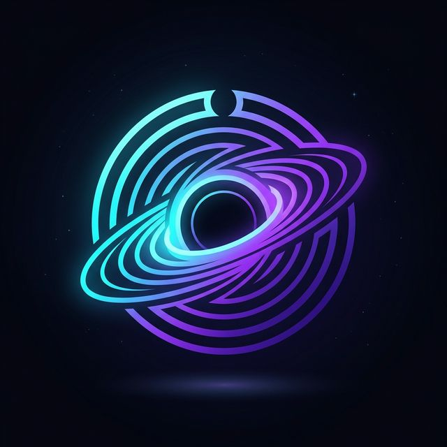

# OpenGravity — Agent-First AI Development, Local and Free

<p align="center">
  
</p>

<p align="center">
  <a href="LICENSE"></a>
  <a href="https://github.com/johnvteixido/OpenGravity/actions"></a>
  <a href="https://github.com/johnvteixido/OpenGravity/releases"></a>
  <a href="https://github.com/johnvteixido/OpenGravity/blob/main/SECURITY.md"></a>
</p>

> **OpenGravity** is a free, local, open-source alternative to Google Antigravity. It brings agent-first AI development to your desktop — 100% offline, 100% private, powered by [Ollama](https://ollama.com) and your own hardware. No subscriptions. No cloud. No data leaving your machine.

---

## ✨ Features

- 🤖 **Agent-First Development** — AI agents plan, code, test, and verify autonomously
- 🔒 **100% Local & Private** — All inference runs on your machine via Ollama
- 🛡️ **Security Sandbox** — Declarative filesystem + network policy; audit logging
- 📦 **Artifact System** — Auto-generates task lists, implementation plans, walkthroughs
- 🌐 **Browser Automation** — Agents can control a real browser to test your app
- 🖥️ **Standalone App** — Native desktop app for Windows, Linux, and macOS
- 🧠 **Multi-Agent Orchestration** — Parallel agents for complex workflows
- ⚡ **Ollama Auto-Setup** — Guided installer if Ollama isn't detected

---

## 🚀 Quick Start

### Prerequisites

- **Windows 10+**, **macOS 12+**, or **Ubuntu 20.04+**
- **[Ollama](https://ollama.com/download)** (OpenGravity will guide you through installation if needed)
- 8 GB RAM minimum · 16 GB recommended · GPU optional but recommended

### Install

Download the latest release for your platform from the [Releases page](https://github.com/johnvteixido/OpenGravity/releases):

| Platform | Package |
|---|---|
| Windows | `OpenGravity-Setup-x.x.x.exe` |
| macOS (Apple Silicon) | `OpenGravity-x.x.x-arm64.dmg` |
| macOS (Intel) | `OpenGravity-x.x.x-x64.dmg` |
| Linux | `OpenGravity-x.x.x.AppImage` |

### First Launch

1. Open **OpenGravity**
2. The **Setup Wizard** will detect Ollama automatically
3. If Ollama is not found, click **Install Ollama** — OpenGravity handles the rest
4. Select a model (e.g. `llama3.2`, `qwen2.5-coder`, `deepseek-r1`)
5. Open or create a workspace folder
6. Start chatting with your AI agent! 🎉

---

## 🏗️ How It Works

```
┌─────────────────────────────────────────────────────┐
│                  OpenGravity App                     │
│  ┌─────────────┐    ┌───────────────────────────┐   │
│  │  Electron   │◄──►│  React UI (Renderer)       │   │
│  │  Main Proc  │    │  Chat · Tasks · Artifacts  │   │
│  └──────┬──────┘    └───────────────────────────┘   │
│         │ IPC / WebSocket                            │
│  ┌──────▼──────────────────────────────────────┐    │
│  │         Python Agent Server (FastAPI)         │    │
│  │  ┌──────────┐  ┌────────┐  ┌─────────────┐  │    │
│  │  │Orchestrat│  │ Planner│  │  Executor   │  │    │
│  │  └──────────┘  └────────┘  └──────┬──────┘  │    │
│  │                                    │ Tools   │    │
│  │  ┌────────┐ ┌────────┐ ┌────────┐ ┌───────┐ │    │
│  │  │  File  │ │ Shell  │ │Browser │ │Search │ │    │
│  │  └────────┘ └────────┘ └────────┘ └───────┘ │    │
│  └──────────────────────┬──────────────────────┘    │
│                          │ HTTP                      │
│  ┌───────────────────────▼───────────────────────┐  │
│  │              Ollama (Local LLM)                │  │
│  └───────────────────────────────────────────────┘  │
└─────────────────────────────────────────────────────┘
```

**Lifecycle:** The Electron main process spawns the Python agent server on startup. The React renderer communicates with the agent server over WebSocket for real-time streaming. The agent server routes inference requests to Ollama — credentials and config stay on the host, never inside the agent sandbox.

---

## 🛡️ Security Model

OpenGravity takes security seriously. Every agent action is governed by policy:

- **Filesystem** — Agents can only read/write within your workspace (configurable)
- **Network** — Outbound requests are allowlisted; all others blocked + logged
- **Shell** — Command allowlist enforced before execution
- **Secrets** — API keys and credentials stored in `~/.opengravity/credentials.json`, never passed to the agent sandbox
- **Audit Log** — Every tool call logged to `~/.opengravity/audit.jsonl`

See [Security Policy](SECURITY.md) and [Security Docs](docs/security.md) for details.

---

## ⚙️ Configuration

After first launch, configuration lives at:

| Path | Purpose |
|---|---|
| `~/.opengravity/config.json` | Model, provider, UI preferences |
| `~/.opengravity/credentials.json` | Provider credentials (never shared) |
| `~/.opengravity/policy.json` | Sandbox policy (filesystem, network, shell) |
| `~/.opengravity/audit.jsonl` | Append-only audit log |

You can edit these via **Settings → Advanced** in the app, or manually.

---

## 🤝 Contributing

We love contributions! Please read [CONTRIBUTING.md](CONTRIBUTING.md) before opening a PR.

- **Bug reports** → [GitHub Issues](https://github.com/johnvteixido/OpenGravity/issues)
- **Feature requests** → [GitHub Discussions](https://github.com/johnvteixido/OpenGravity/discussions)
- **Security vulnerabilities** → See [SECURITY.md](SECURITY.md) — do NOT open public issues

---

## 📚 Documentation

| Doc | Description |
|---|---|
| [Overview](docs/overview.md) | What OpenGravity is and how it fits together |
| [Quick Start](docs/quick-start.md) | Detailed setup guide |
| [Architecture](docs/architecture.md) | Component diagram and data flow |
| [Providers](docs/providers.md) | Configuring Ollama and other providers |
| [Security](docs/security.md) | Sandbox design and policy configuration |

---

## 📄 License

This project is licensed under the [Apache License 2.0](LICENSE).

---

## 🌟 Acknowledgements

OpenGravity is inspired by [Google Antigravity](https://blog.google) and draws architectural inspiration from [NVIDIA NemoClaw](https://github.com/NVIDIA/NemoClaw). Built with ❤️ by [johnvteixido](https://github.com/johnvteixido) and the open-source community.
